# D3SVG Gallery

Visual reference for all chart, diagram, and infographic types available in the D3SVG opack.
All outputs are standalone SVG, JSVG-compatible, with no browser DOM required.

---

## Charts

### Bar Chart — Vertical

```javascript
var d = require("d3svg.js")
io.writeFileString("bar.svg", d.barChart([
  { category: "Jan", value: 120 }, { category: "Feb", value: 98  },
  { category: "Mar", value: 145 }, { category: "Apr", value: 162 },
  { category: "May", value: 134 }, { category: "Jun", value: 188 }
], { width: 560, height: 320, title: "Monthly Sales", showGrid: true, showValues: true,
     x: { field: "category", label: "Month" }, y: { field: "value", label: "Sales" } }))
```

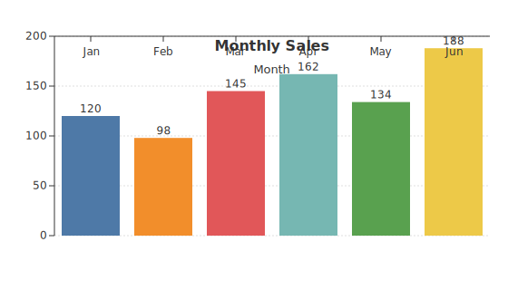

---

### Bar Chart — Horizontal

```javascript
io.writeFileString("hbar.svg", d.barChart(data, {
  width: 560, height: 300, title: "Revenue by Product",
  x: { field: "product" }, y: { field: "revenue", label: "Revenue ($)" },
  horizontal: true, theme: "minimal"
}))
```

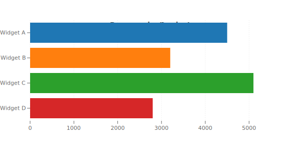

---

### Stacked Bar Chart

Groups multiple series into stacked bars. Series are auto-detected from data fields or specified explicitly.

```javascript
io.writeFileString("stacked.svg", d.stackedBarChart([
  { q: "Q1", dev: 45, qa: 20, ops: 15 },
  { q: "Q2", dev: 52, qa: 18, ops: 22 },
  { q: "Q3", dev: 60, qa: 25, ops: 18 },
  { q: "Q4", dev: 55, qa: 30, ops: 20 }
], {
  category: "q",
  series: [{ key: "dev", label: "Dev" }, { key: "qa", label: "QA" }, { key: "ops", label: "Ops" }],
  title: "Team Effort by Quarter", width: 560, height: 340, showLegend: true
}))
```

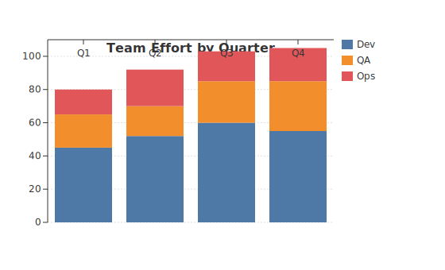

---

### Line Chart — Single Series

```javascript
io.writeFileString("line.svg", d.lineChart(data, {
  width: 560, height: 320, title: "Seasonal Trend",
  curve: "monotone", showDots: true,
  x: { label: "Month" }, y: { label: "Value" }
}))
```

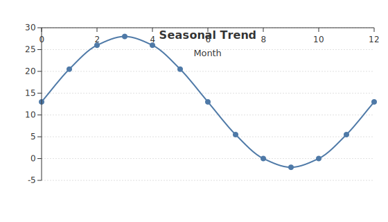

---

### Line Chart — Multi-Series

Pass an array of `{ name, values }` objects for multi-series with optional legend.

```javascript
io.writeFileString("line_multi.svg", d.lineChart([
  { name: "Product A", values: [{ x: 1, y: 30 }, { x: 2, y: 45 }, ...] },
  { name: "Product B", values: [{ x: 1, y: 20 }, { x: 2, y: 28 }, ...] },
  { name: "Product C", values: [{ x: 1, y: 10 }, { x: 2, y: 15 }, ...] }
], { width: 580, height: 340, title: "Product Sales Comparison",
     showLegend: true, curve: "monotone", showDots: true }))
```

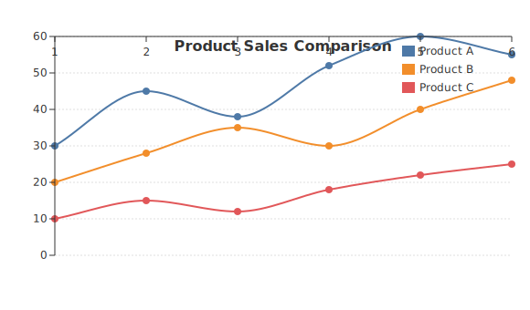

---

### Area Chart

Line chart with a filled region beneath. Supports single and multi-series.

```javascript
io.writeFileString("area.svg", d.areaChart([
  { x: 0, y: 5 }, { x: 1, y: 12 }, { x: 2, y: 8 },
  { x: 3, y: 20 }, { x: 4, y: 15 }, { x: 5, y: 25 }
], {
  width: 560, height: 320, title: "Revenue Over Time",
  curve: "monotone", fillOpacity: 0.25,
  x: { label: "Month" }, y: { label: "Revenue" }
}))
```

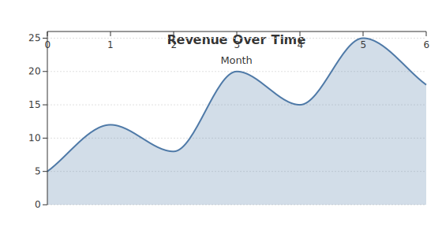

---

### Scatter Plot

```javascript
io.writeFileString("scatter.svg", d.scatterPlot(data, {
  width: 540, height: 360, title: "Correlation Analysis",
  showGrid: true, dotRadius: 6,
  x: { label: "Variable X" }, y: { label: "Variable Y" }
}))
```

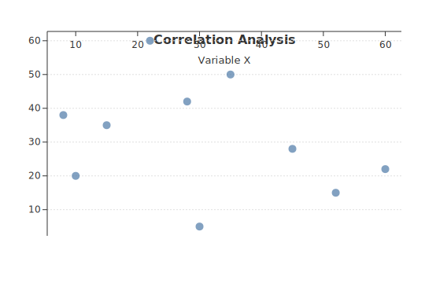

---

### Pie Chart

```javascript
io.writeFileString("pie.svg", d.pieChart([
  { name: "Alpha Corp", value: 35 }, { name: "Beta Ltd",  value: 28 },
  { name: "Gamma Inc",  value: 20 }, { name: "Delta Co",  value: 10 },
  { name: "Other",      value:  7 }
], { width: 480, height: 400, title: "Market Share",
     showLegend: true, showPercent: true }))
```

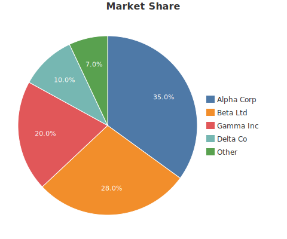

---

### Donut Chart

```javascript
io.writeFileString("donut.svg", d.pieChart(data, {
  width: 480, height: 400, title: "Market Share",
  donut: true, donutRatio: 0.55, showLegend: true
}))
```

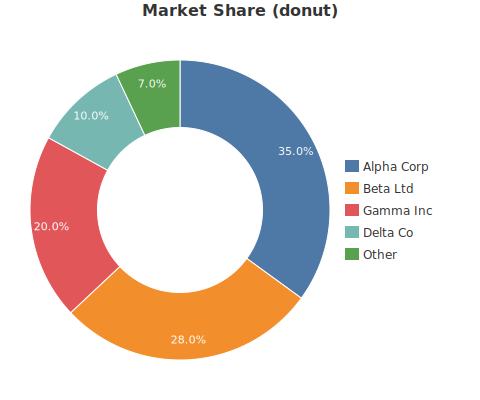

---

### Heatmap

Grid-based matrix visualization with interpolated color scaling.

```javascript
// data: [{ row: "Mon", col: "Jan", value: 42 }, ...]
io.writeFileString("heatmap.svg", d.heatmap(data, {
  width: 520, height: 320, title: "Activity Heatmap",
  showValues: true, colorLow: "#eaf3fb", colorHigh: "#1a5276",
  x: { label: "Month" }, y: { label: "Day" }
}))
```

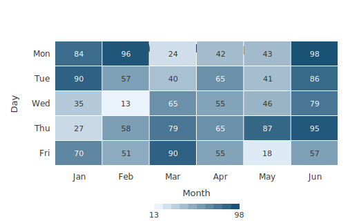

---

### Sparkline

Compact mini inline chart, ideal for dashboards and tables.

```javascript
io.writeFileString("spark.svg", d.sparkline([5, 8, 3, 12, 7, 15, 10, 18, 14, 20], {
  width: 150, height: 50, showArea: true
}))
```

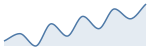

---

## Diagrams & Infographics

### Gauge

Radial arc gauge with threshold coloring and optional needle.

```javascript
io.writeFileString("gauge.svg", d.gauge(72, {
  width: 320, height: 210, min: 0, max: 100,
  title: "Performance Score", unit: "%",
  showNeedle: true, showValue: true, showMinMax: true,
  thresholds: [
    { value: 0,  color: "#e74c3c" },
    { value: 40, color: "#f39c12" },
    { value: 70, color: "#27ae60" }
  ]
}))
```

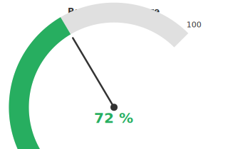

---

### Progress Bar

Single or multi-row progress bars with labels and percentage display.

```javascript
io.writeFileString("progress.svg", d.progressBar([
  { label: "Frontend", value: 85, color: "#3498db" },
  { label: "Backend",  value: 62, color: "#9b59b6" },
  { label: "Testing",  value: 45, color: "#e67e22" },
  { label: "Docs",     value: 30, color: "#1abc9c" }
], { width: 440, height: 220, title: "Project Completion" }))
```

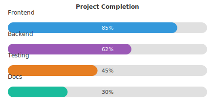

---

### KPI Card

Metric display cards with value, label, and change indicator. Supports grid layout.

```javascript
io.writeFileString("kpi.svg", d.kpiCard([
  { label: "Revenue",   value: "$2.4M", change: 18.5  },
  { label: "Users",     value: "48.2K", change: -2.1  },
  { label: "Uptime",    value: "99.9%", change:  0.1  },
  { label: "NPS Score", value: 72,      change:  5.3  }
], { width: 560, height: 130, cols: 4 }))
```

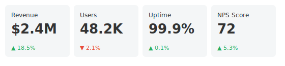

---

### Bullet Chart

Shows actual value vs. target marker with qualitative background ranges.

```javascript
io.writeFileString("bullet.svg", d.bulletChart([
  { label: "Revenue", value: 220, target: 240,
    ranges: [{ value: 150, color: "#fad7a0" }, { value: 225, color: "#fef9e7" }, { value: 300, color: "#eafaf1" }] },
  { label: "Profit",  value: 55,  target: 70,
    ranges: [{ value: 40, color: "#fadbd8" }, { value: 65, color: "#fef9e7" }, { value: 90, color: "#eafaf1" }]  },
  { label: "Orders",  value: 180, target: 200,
    ranges: [{ value: 120, color: "#d6eaf8" }, { value: 185, color: "#eaf8ff" }, { value: 240, color: "#eafaf1" }] }
], { title: "Sales Performance vs Target", width: 540, height: 200, showValues: true }))
```

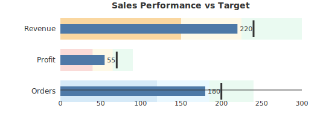

---

### Timeline

Horizontal event timeline with alternating above/below labels.

```javascript
io.writeFileString("timeline.svg", d.timeline([
  { label: "Kick-off", date: "Jan 2024", color: "#3498db" },
  { label: "Alpha",    date: "Mar 2024", color: "#9b59b6" },
  { label: "Beta",     date: "Jun 2024", color: "#f39c12" },
  { label: "RC",       date: "Sep 2024", color: "#e74c3c" },
  { label: "GA",       date: "Dec 2024", color: "#27ae60" }
], { width: 640, height: 180, title: "Product Roadmap 2024" }))
```

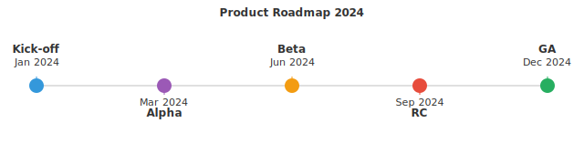

---

## Themes

### Dark Theme

```javascript
io.writeFileString("dark.svg", d.barChart(data, { theme: "dark" }))
```

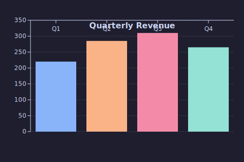

Available themes: **`default`** (white, Tableau palette) · **`dark`** (dark background, Catppuccin-inspired) · **`minimal`** (clean white, muted palette)

---

## API Quick Reference

| Function | Description |
|---|---|
| `SVG(opts)` | Low-level SVG document builder |
| `scaleLinear()` | Continuous linear scale |
| `scaleBand()` | Ordinal band scale for bar charts |
| `linePath(points, opts)` | Line/curve path generator |
| `arcPath(opts)` | Arc/wedge path generator |
| `axisBottom(scale, opts)` | Bottom axis renderer |
| `axisLeft(scale, opts)` | Left axis renderer |
| `barChart(data, opts)` | Vertical or horizontal bar chart |
| `stackedBarChart(data, opts)` | Stacked bar chart with multiple series |
| `lineChart(data, opts)` | Single or multi-series line chart |
| `areaChart(data, opts)` | Line chart with filled area |
| `scatterPlot(data, opts)` | Scatter / bubble plot |
| `pieChart(data, opts)` | Pie or donut chart |
| `heatmap(data, opts)` | Matrix heatmap |
| `sparkline(data, opts)` | Mini inline trend chart |
| `gauge(value, opts)` | Radial arc gauge |
| `progressBar(value, opts)` | Horizontal progress bar(s) |
| `kpiCard(data, opts)` | KPI metric display cards |
| `bulletChart(data, opts)` | Bullet chart with target marker |
| `timeline(data, opts)` | Horizontal event timeline |
| `getTheme(name)` | Get theme object (`default`, `dark`, `minimal`) |
