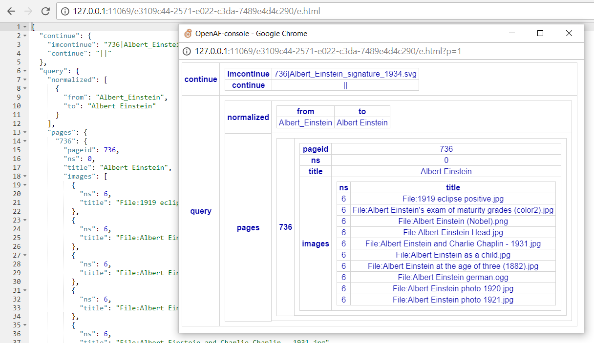

# inBrowser

The inBrowser oPack enables the visualization and edition of maps and arrays in the operating system browser triggered from the openaf-console.

## Quick examples:

### Using openaf-console aliases

Add to you ~/.openaf-console_profile file:

````javascript
load("inBrowser.js");
````

Once you reopen openaf-console a set of aliases will become available:

````javascript
> // To open in read-only mode
> bshow myVar
>
> // To edit a variable
> bedit myVar
>
> // To watch a variable every 2,5 seconds
> bwatch 2500 myVar
````

You can add a specfic title to each window open:

````javascript
> // Open a window titled Var1 to edit var1
> btitle Var1
> bedit var1
> bnotitle
>
> // Open a window titled Var2 to edit var2
> btitle Var2
> bedit var2
> bnotitle
````

You can also specify a different theme:

````javascript
> // Edit var1 use the monokai theme
> btheme monokay
> bedit var1
>
> // list available themes
> inBrowser.listThemes();
````


### Direct use of myBrowser

1. On the openaf-console: 
````javascript
> load("inBrowser.js")
> var mymap = { a: 1, b: true, c: "test" }
> mymap = inBrowser.edit(mymap);
````
2. A browser window will be created: 

3. Change the contents as you like:

4. Close the browser and check the variable mymap
````javascript
> mymap
{
  "a": 1,
  "b": false,
  "c": "test",
  "d": [
    1,
    2,
    3,
    4
  ]
}
````

### Using it through a TCP tunnel

To execute openaf-console on computer B and use the browser windows on computer A just create a TCP tunnel (e.g. ssh, OpenAF's SSH plugin, etc...)
between the two on a specific port (e.g. 8888). Then simple execute:

````javascript
> inBrowser.setPort(8888);
> bedit myVar
Open a browser on: http://127.0.0.1:12345/dc308448-c226-003a-a1a5-6fa38ed4a521
>
````

## Different formats for editing and visualize

While in the browser window you can change the way to edit and/or visualize by right-clicking on the window:


From this menu you can choose different formats to edit (e.g. YAML, JSON) or to visualize (e.g. table, chart).




## Keyboard shortcuts

When using the main editors for YAML and JSON there are a couple of custom keyboard shortcuts:

   * **Alt-S / Command-S** will try to save to the current contents back to the server
   * **Alt-R / Command-R** will try to reload the contents from the server
   * **Ctrl-Alt-P / Ctrl-Option-P** will popup the current window if possible
   * **Ctrl-Alt-B / Ctrl-Option-B** will try to beautify the current content (in editor mode)

Of course all the keyboard shortcuts for the ACE editor are still available including multicursor, find/replace, etc. Check them out on https://github.com/ajaxorg/ace/wiki/Default-Keyboard-Shortcuts.
