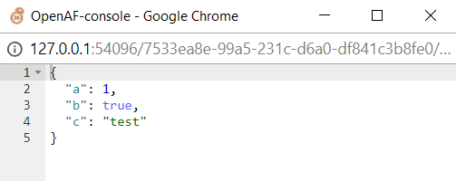

# inBrowser

The inBrowser oPack enables the visualization and edition of maps and arrays in the operating system browser triggered from the openaf-console.

## Quick example:

1. On the openaf-console: 
````javascript
> load("inBrowser.js")
> var mymap = { a: 1, b: true, c: "test" }
> mymap = inBrowser.edit(mymap);
````
2. A browser window will be created: 

3. Change the contents as you like:

4. Close the browser and check the variable mymap
````javascript
> mymap
{
  "a": 1,
  "b": false,
  "c": "test",
  "d": [
    1,
    2,
    3,
    4
  ]
}
````

## Different formats for editing and visualize

While in the browser window you can change the way to edit and/or visualize by right-clicking on the window:


From this menu you can choose different formats to edit (e.g. YAML, JSON) or to visualize (e.g. table, chart).


